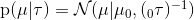

# Variational inference applied to a univariate Gaussian

### Implementation and more is provided in the notebook "Variational_inference_UG.ipynb"

##### Adapted from the two books: Pattern Recognition and Machine Learning Christopher M. Bishop and A Probabilistic Perspective Murphy 2012.

Given a data set:

which are i.i.d and drawn from a 1d Gaussian which likelihood function is given by:

Where the conjugate prior distributions for  is given by:

With the mean field method we factorize the approximate distribution such that it is given by: 

The following video sequence was generated with 15 data points and the following parameters:

And the following shows the exact posterior with the approximate (20 data points):

Where the exact posterior is given by:

